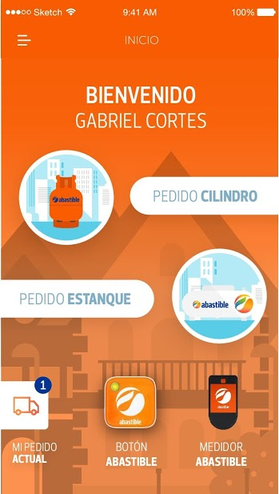
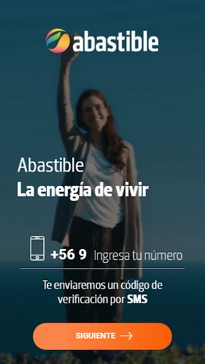
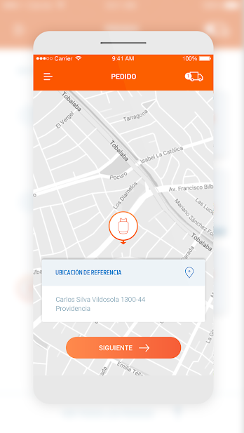
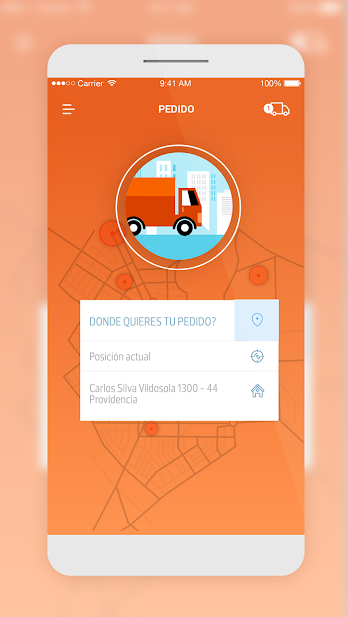
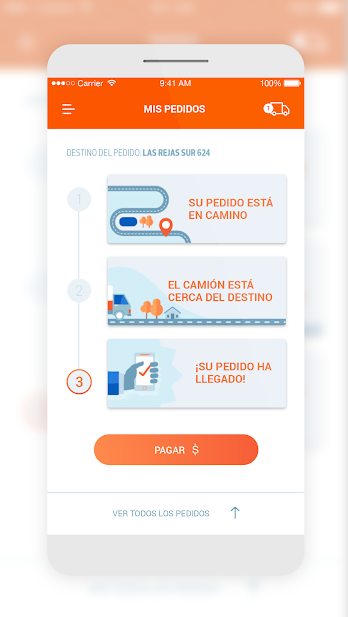

 
## ¿Qué pasa con las aplicaciones de compra de gas en Chile si las analizamos desde el punto de vista de la privacidad?

Esta vez ampliaré los tópicos analizados en el blog, para incorporar un poco de análisis a 
aplicaciones del Sistema Operativo Android, a modo de introducción les cuento que en mi país,
existe una variedad de aplicaciones pensadas para la compra de gas licuado, algunas con
elementos diferenciadores como la lectura de medidores a la cantidad restante de gas, etc.
Entre las compañías que poseen aplicaciones móviles, se encuentran Gasco, Abastible, Lipigas,
entre otras. Para acotar el periodo de estudio, se realizará un análisis a las mencionadas. Si bien
estas aplicaciones están disponibles también para iOS, sólo revisaré las versiones de Android,
considerando que gran parte de éstas, a modo de spoiler, se basan en tecnologías multiplataforma.

Luego de ver que han tenido un nivel de aceptación importante algunas de ellas en la PlayStore,
superando las descargas respecto a aplicaciones como "atrapa los gatitos", me pregunté si 
al momento de ser desarrolladas se tuvo en cuenta la seguridad, y por sobre todo la privacidad
de los usuarios en cuenta, debido a que, me imagino se realizan estudios de mercado, tendencias 
y perfilamiento de usuarios en base a los datos entregados por las aplicaciones, lo que veremos 
si es refutado o demostrado en los apartados siguientes.

Si bien podría hacer un análisis aplicación a aplicación para hacer la lectura más amena por parte de
mis estimados lectores, el procedimiento a llevar a cabo será el siguiente:

1. Se dará un resumen de los datos entregados al momento de buscar las aplicaciones en el market.
2. Se descargará la aplicación para la obtención de información en base a archivos contenidos en el
paquete APK.
3. El archivo AndroidManifest.xml será revisado y analizado concienzudamente, en busca de cualquier
comportamiento anómalo considerando el contexto de las aplicaciones analizadas.
4. Análisis de código estático.
5. Análsis dinámico de las aplicaciones.
6. Conclusiones.

## Primer entrega: Aplicación Abastible

Por lo que vamos a comenzar con la aplicación publicada por Abastible, veamos que podemos obtener desde la 
PlayStore.

> En la descripción podemos ver la siguiente leyenda:
>
>Nunca fue tan fácil pedir gas como con la App de Abastible
>Tus direcciones recurrentes aparecerán automáticamente, podrás revisar tus pedidos anteriores y programar pedidos 
>para los próximos días. Además podrás saber los precios en línea del gas según tu georreferencia.
>¡Recibe notificaciones en tu equipo cuando tu pedido esté en camino!
>Además podrás solicitar tu Medidor y Botón Abastible
>Abastible, La energía de vivir
>www.abastible.cl
>

Basado en este pequeño apartado o descripción general de la aplicación, surgen ciertas inquietudes, por ejemplo se guardan las direcciones recurrentes, lo que permite crear un perfil de ubicaciones
del usuario, a modo preliminar ¿éstas las define el usuario o el sistema/aplicación las define en base a los pedidos?, y los precios en base a georreferencia, se generan las consultas al sistema correspondiente al abrir
la aplicación o hay un servicio de aplicación que constantemente consulta la ubicación del usuario?. Estas preguntas serán respondidas a medida que se avance en la publicación.

En cuanto a como se ve la aplicación las capturas publicadas en el mismo market son las siguientes:

		<article>
			
		</article>
		<article>
			
		</article>
		<article>
			
		</article>
		<article>
			
		</article>
		<article>
			
		</article>

A simple vista aún siendo aparentemente un mockup, la aplicación parece un webview, vamos a
confirmar esto más adelante. Ahora se procederá a descargar el APK, para su análisis.

## Primera parte: recabando información
### Permisos:
Los permisos mostrados en el market son los siguientes, los que serán contrastados con la información
recabada en el análisis:

This app has access to:
Identity

    find accounts on the device

Contacts

    find accounts on the device
    read your contacts
    modify your contacts

Location

    approximate location (network-based)
    precise location (GPS and network-based)

Photos/Media/Files

    read the contents of your USB storage
    modify or delete the contents of your USB storage

Storage

    read the contents of your USB storage
    modify or delete the contents of your USB storage

Microphone

    record audio

Wi-Fi connection information

    view Wi-Fi connections

Other

    receive data from Internet
    view network connections
    pair with Bluetooth devices
    access Bluetooth settings
    allow Wi-Fi Multicast reception
    connect and disconnect from Wi-Fi
    full network access
    control vibration
    prevent device from sleeping

Ok, debo reconocer que se solicitan muchos permisos, desde mi punto de vista, aunque en mi actual estado
al igual que ustedes no he revisado el código, para hacerme una idea del por qué esto es así, debido a 
que un nivel inferior de permisos podría generar un decremento, o derechamente la no correcta funcionalidad
de la aplicación, pero por otro lado, creo que se debe usar un mínimo de permisos que lleven a la aplicación
al correcto funcionamiento sin resultar en un decremento a la privacidad del usuario, lo primero que me llama la
atención fuera de la gran cantidad de permisos, es la falta de una política clara sobre el uso de los datos del 
usuario, si visitan el sitio web designado a la aplicación o la empresa, no existe un documento que defina los
usos de estos datos. 

El contenido del archivo AndroidManifest.xml contiene lo siguiente:

	<?xml version="1.0" encoding="utf-8"?>
	<manifest android:installLocation="internalOnly" android:windowSoftInputMode="adjustPan" package="
	com.abastible.pedido" platformBuildVersionCode="25" platformBuildVersionName="7.1.1" 
	xmlns:android="http://schemas.android.com/apk/res/android">
    <uses-sdk android:minSdkVersion="18" android:targetSdkVersion="24" />
    <supports-screens android:anyDensity="true" android:largeScreens="true" android:normalScreens="true"
     android:resizeable="true" android:smallScreens="true" android:xlargeScreens="true" />
    <uses-permission android:name="android.permission.INTERNET" />
    <uses-permission android:name="android.permission.ACCESS_NETWORK_STATE" />
    <uses-permission android:name="android.permission.ACCESS_COARSE_LOCATION" />
    <uses-permission android:name="android.permission.ACCESS_FINE_LOCATION" />
    <uses-feature android:name="android.hardware.location.gps" />
    <uses-permission android:name="android.permission.WRITE_EXTERNAL_STORAGE" />
    <uses-permission android:name="android.permission.RECORD_AUDIO" />
    <uses-permission android:name="android.permission.RECORD_VIDEO" />
    <uses-permission android:name="android.permission.READ_EXTERNAL_STORAGE" />
    <uses-permission android:name="android.permission.READ_CONTACTS" />
    <uses-permission android:name="android.permission.WRITE_CONTACTS" />
	    <uses-permission android:name="android.permission.GET_ACCOUNTS" />
	    <uses-permission android:name="android.permission.ACCESS_WIFI_STATE" />
	    <uses-permission android:name="android.permission.CHANGE_WIFI_MULTICAST_STATE" />
	    <uses-permission android:name="android.permission.BLUETOOTH" />
	    <uses-permission android:name="android.permission.CHANGE_WIFI_STATE" />
	    <uses-permission android:name="android.permission.BLUETOOTH_ADMIN" />
	    <uses-permission android:name="android.permission.WAKE_LOCK" />
	    <uses-permission android:name="android.permission.VIBRATE" />
	    <uses-permission android:name="com.google.android.c2dm.permission.RECEIVE" />
	    <permission android:name="com.abastible.pedido.permission.C2D_MESSAGE"
	     android:protectionLevel="signature" />
	    <uses-permission android:name="com.abastible.pedido.permission.C2D_MESSAGE" />
	    <uses-permission android:name="com.sec.android.provider.badge.permission.READ" />
	    <uses-permission android:name="com.sec.android.provider.badge.permission.WRITE" />
	    <uses-permission android:name="com.htc.launcher.permission.READ_SETTINGS" />
	    <uses-permission android:name="com.htc.launcher.permission.UPDATE_SHORTCUT" />
	    <uses-permission android:name="com.sonyericsson.home.permission.BROADCAST_BADGE" />
	    <uses-permission android:name="com.sonymobile.home.permission.PROVIDER_INSERT_BADGE" />
	    <uses-permission android:name="com.anddoes.launcher.permission.UPDATE_COUNT" />
	    <uses-permission android:name="com.majeur.launcher.permission.UPDATE_BADGE" />
	    <uses-permission android:name="com.huawei.android.launcher.permission.CHANGE_BADGE" />
	    <uses-permission android:name="com.huawei.android.launcher.permission.READ_SETTINGS" />
	    <uses-permission android:name="com.huawei.android.launcher.permission.WRITE_SETTINGS" />
	    <uses-permission android:name="android.permission.READ_APP_BADGE" />
	    <uses-permission android:name="com.oppo.launcher.permission.READ_SETTINGS" />
	    <uses-permission android:name="com.oppo.launcher.permission.WRITE_SETTINGS" />
	    <uses-permission android:name="me.everything.badger.permission.BADGE_COUNT_READ" />
	    <uses-permission android:name="me.everything.badger.permission.BADGE_COUNT_WRITE" />
	    <meta-data android:name="android.support.VERSION" android:value="26.0.0-alpha1" />
	    <application android:allowBackup="true" android:hardwareAccelerated="true" android:icon="@mipmap/icon" 
	    android:label="@string/app_name" android:supportsRtl="true">
	        <activity android:configChanges="locale|keyboard|keyboardHidden|orientation|screenSize" 
	        android:label="@string/app_name" android:name="com.abastible.pedido.Abastible" 
	        android:screenOrientation="portrait" android:windowSoftInputMode="adjustResize|stateHidden">
	            <intent-filter>
	                <action android:name="android.intent.action.MAIN" />
	                <category android:name="android.intent.category.LAUNCHER" />
	            </intent-filter>
	        </activity>
	        <provider android:authorities="com.abastible.pedido.provider" android:exported="false"
	         android:grantUriPermissions="true" android:name="android.support.v4.content.FileProvider">
	            <meta-data android:name="android.support.FILE_PROVIDER_PATHS" 
	            android:resource="@xml/provider_paths" />
	        </provider>
	        <activity android:name="com.keyes.youtube.OpenYouTubePlayerActivity" android:screenOrientation="landscape" />
	        <activity android:configChanges="locale|keyboard|keyboardHidden|orientation|screenSize" 
	        android:label="@string/activity_name" android:launchMode="singleTop" android:name="
	        com.bunkerpalace.cordova.YouTubeActivity" android:theme="@android:style/Theme.Black.NoTitleBar" 
	        android:windowSoftInputMode="adjustResize" />
	        <activity android:exported="true" android:name="com.adobe.phonegap.push.PushHandlerActivity" />
	        <receiver android:exported="true" android:name="com.google.android.gms.gcm.GcmReceiver"
	         android:permission="com.google.android.c2dm.permission.SEND">
	            <intent-filter>
	                <action android:name="com.google.android.c2dm.intent.RECEIVE" />
	                <category android:name="com.abastible.pedido" />
	            </intent-filter>
	        </receiver>
	        <service android:exported="false" android:name="com.adobe.phonegap.push.GCMIntentService">
	            <intent-filter>
	                <action android:name="com.google.android.c2dm.intent.RECEIVE" />
	            </intent-filter>
	        </service>
	        <service android:exported="false" 
	        android:name="com.adobe.phonegap.push.PushInstanceIDListenerService">
	            <intent-filter>
	                <action android:name="com.google.android.gms.iid.InstanceID" />
	            </intent-filter>
	        </service>
	        <service android:exported="false" android:name="com.adobe.phonegap.push.RegistrationIntentService" />
	        <meta-data android:name="com.facebook.sdk.ApplicationId" android:value="@string/facebook_app_id" />
	        <activity android:configChanges="keyboard|keyboardHidden|orientation|screenLayout|screenSize"
	         android:label="@string/app_name" android:name="com.facebook.FacebookActivity"
	         android:theme="
	         @android:style/Theme.Translucent.NoTitleBar" />
	        <provider android:authorities="com.facebook.app.FacebookContentProvider1337760526260883" 
	        android:exported="true" android:name="com.facebook.FacebookContentProvider" />
	        <activity android:exported="false" android:name="com.google.android.gms.common.api.GoogleApiActivity" 
	        android:theme="@android:style/Theme.Translucent.NoTitleBar"/>
	        <meta-data android:name="com.google.android.gms.version" android:value="@integer/
	        google_play_services_version" />
	    </application>
	</manifest>

Como podemos apreciar el contenido es bastante extenso, por lo que los puntos a destacar son los 
siguientes:

* **android.permission.RECORD_AUDIO**
* **android.permission.RECORD_VIDEO**

Considerando la funcionalidad de la aplicación, me parece excesivo el uso de estos permisos,
grabar audio y video con que finalidad. Si bien podría estar declarado el permiso, y no ser usado
en ninguna parte del código, el sólo hecho de tenerlo definido en el AndroidManifest, podría afectar la privacidad del usuario, 
sin contar con dejar espacio a ataques por parte de terceros.

* **android.permission.READ_CONTACTS**
* **android.permission.WRITE_CONTACTS**

Leer los contactos del dispositivo? escritura?, nuevamente un permiso que invade la privacidad de los
usuarios, y que podría ser usado con fines no tan benignos, por ejemplo campañas de ads, o peor.

* **android.permission.GET_ACCOUNTS**

Éste permiso permite el acceso a las cuentas asociadas al dispositivo, la aplicación utiliza
servicios de Google como cloud messages, pero también permite iniciar sesión por medio de la cuenta de 
Facebook, tomando en cuenta que se tendrá acceso a información del perfil, si se le concede acceso. Pero
desgraciadamente las personas lo ven como una alternativa más rápida, y evitar completar formularios de
registro, siendo que la información entregada por las API de Facebook puede ser mayor a la solicitada en 
el registro.

* **android.permission.BLUETOOTH_ADMIN**
* **android.permission.BLUETOOTH**
* **android.permission.ACCESS_WIFI_STATE**
* **android.permission.CHANGE_WIFI_MULTICAST_STATE**

Permisos asociados al uso y control de redes WIFI, BLUETOOTH, debido a requerir conectar con el 
medidor de gas, al revisar el código, quedará más claro cual método es el utilizado. No se incluyó
permisos generados por el framework, phonegap, cordova, etc. Cabe resaltar el acceso a la ubicación
en modo preciso "GPS", para determinar desde donde se realiza el pedido por supuesto, por lo que
se asume como un mal necesario para la correcta operación de la aplicación. Una vez revisando el 
código se ha determinado que el acceso a BLUETOOTH es necesario para el medidor, y el permiso
de WIFI para el botón. 

A modo de conclusión los dos primeros permisos me incomodan bastante, pero más que un intento 
deliverado de intrusión a la privacidad de los usuarios, me parece que los desarrolladores 
simplemente usaron permisos por defecto al crear la aplicación. Debo resaltar el enfoque del
estudio, por lo que no será expuesto código que cuyo resultado pueda generar vulnerabilidades,
superficie de ataque, etc. Por lo que no esperes encontrar en esta reseña como adquirir gas sin
costo xD, o pasos a seguir para la manipulación del servidor, etc. Volviendo a lo nuestro,
una vez ya hemos analizados los permisos, podemos concluir que a primera impresión existen solicitudes
innecesarias al funcionamiento de la App en nuestros dispositivos.

### Haciéndose con el fichero APK:

Bueno ahora a revisar el código de la aplicación, para esto primero vamos a identificar el
contenido del fichero APK, separando actividades, receivers, servicios, etc. Ya que pueden
no estar definidos en el archivo AndroidManifest.xml.

Para comenzar obtenemos que los directorios usados por la aplicación son los siguientes:

	 Data Directory: /data/data/com.abastible.pedido
	 APK Path: /data/app/com.abastible.pedido-1.apk

Descargamos el archivo en nuestro computador por medio de adb, pudo usarse otros medios, por ejemplo
utilizar un sitio web alternativo, un market alternativo, un leecher de PlayStore, etc. Creo que la
instalación desde el market original, permite mantener cierto nivel de confianza en cuanto a ser la
App del desarrollador original. Al inspeccionar a macro nivel la jerarquía de directorios, generada
al abrir el APK, veremos que no posee uso de librerías compartidas o código nativo C++, también 
se reafirman las suposiciones iniciales, y se ha usado el framework cordova, y phonegap.

#### Activities:

Las siguientes actividades permiten el inicio por parte de cualquiera:

	com.abastible.pedido.Abastible
	    Permission: null
	com.adobe.phonegap.push.PushHandlerActivity
		Permission: null

Las actividades no exportadas o de acceso restringido:

	com.keyes.youtube.OpenYouTubePlayerActivity
	    Permission: null
	com.bunkerpalace.cordova.YouTubeActivity
	    Permission: null
	com.facebook.FacebookActivity
		Permission: null
	com.google.android.gms.common.api.GoogleApiActivity
	    Permission: null

#### Broadcast Receivers:

Los siguientes receivers han sido exportados:

	com.google.android.gms.gcm.GcmReceiver
		Permission: com.google.android.c2dm.permission.SEND

No posee sin exportar.

#### Services:

No posee servicios exportados, por lo que los sin exportar son los siguientes:

	 com.adobe.phonegap.push.GCMIntentService
	      Permission: null
	 com.adobe.phonegap.push.PushInstanceIDListenerService
	      Permission: null
	 com.adobe.phonegap.push.RegistrationIntentService
	      Permission: null

#### Content Providers:

Se tiene los siguientes exportados:

	 Authority: com.facebook.app.FacebookContentProvider1337760526260883
	      Read Permission: null
	      Write Permission: null
	      Content Provider: com.facebook.FacebookContentProvider
	      Multiprocess Allowed: False
	      Grant Uri Permissions: False

Y los siguientes sin exportar:

	 Authority: com.abastible.pedido.provider
	      Read Permission: null
	      Write Permission: null
	      Content Provider: android.support.v4.content.FileProvider
	      Multiprocess Allowed: False
	      Grant Uri Permissions: True

### Certificado:
Veamos que tal el certificado usado para la firma de la aplicación.

	 Type: cert
	- Name: Certificate
	- Parent unit: com.abastible.pedido-1.apk
	- Children units: 0
	- Human-readable dump:
	Type: X.509
	Version: 3
	Serial Number: 0x5744cbb6
	Issuer: CN=Unknown, OU=Unknown, O=Unknown, L=Unknown, ST=Unknown, C=Unknown
	Validity: from = Tue May 24 15:46:30 MDT 2016
	            to = Sat Oct 10 15:46:30 MDT 2043
	Subject: CN=Unknown, OU=Unknown, O=Unknown, L=Unknown, ST=Unknown, C=Unknown

	Public Key:
	  type = RSA 2048 bits
	  exponent = 65537
	  modulus = 1922460370903677269190409035259390995874781639496146935361684155792560409028803
	  99308477515484627043389233656052653140659929175971839814080836178946203813907690715776585
	  01159518116435936122735066681821077051693119016737094028084331371868183296957995314011003
	  65983915860913923649947178012597136786968271324872201176672042465947151000159551409459783
	  51322916804557584902600913870337487150412002675737646865184169399442897030878095066106087
	  25025422281666585389593696584828368938874516667893354650158217233461376029865131555193041
	  71436074282292566047911524066816345328574594994935533796430772471430831537671941615857170
	  281
	Signature:
	  type = SHA1withRSA, OID = 1.2.840.113549.1.1.5
	  hexdata = 55 E4 14 58 B9 0B DA 24 DA 37 EA BC 55 99 63 76 07 6E BA 3D 1E 3C 8D B3 48 4B 5A CC 
	  A3 E0 83 76 0F A3 1F BF AF 7D 78 7C FC 1C DE 38 46 20 CF CC 16 CE 09 A5 11 01 27 2A BF 3E E6 
	  79 28 45 62 8C FF DA 94 AC E9 26 61 E6 39 B1 C9 B5 B3 A7 D3 41 D0 5D 8C 38 70 4F FD BA BC A6 
	  94 ED 3E 3A C6 68 E8 88 D9 BD AA 43 7A 93 EB 78 80 4D 90 31 34 BF 72 26 65 3D 9E CC 8A 6D FE 
	  71 28 5C 87 F1 DF 52 CC DF 7C 1C E1 FB 3F 5E 38 02 A5 6B 63 6E 9F 84 14 1A CB 85 9B 5B 69 5F 
	  CF 59 C1 0C 01 18 DD AD 1E EB C7 ED F5 04 3B 7F 54 55 54 7D 5E 9D BA 71 A5 DA DD 41 8F 17 31 
	  8C 81 B8 09 46 D3 57 3A BA F5 73 71 62 84 45 CD 56 B4 4C A9 D2 64 9D 9F 94 FA D9 92 A6 B6 39 
	  4C 10 4E 73 E1 B3 23 68 D3 08 D3 59 D5 A7 20 AF F7 24 7D 8F 40 74 85 9E 1D 99 A2 43 4D 76 D3 
	  94 FB B9 E7 4C E5 11 81 E8 E1 DF 

	MD5 Fingerprint: 7B EA 40 3F BF 57 39 1A 3F 44 A3 6E CB 14 F1 70 
	SHA-1 Fingerprint: 71 BE 70 3C 13 8C A3 BC 1C DC 5B 22 42 D2 E7 BE DE 54 04 9C 
	SHA-256 Fingerprint: 99 7C AF 5F 7A 90 FA 39 DD EB DD F9 C8 B5 34 10 C1 F9 4B 19 77 02 EF 89 C8 
	F9 42 21 93 FE 1C 9C 

Por qué se ha usado un certificado con datos nulos? simple, android permite el uso de certificados autofirmados,
no se requiere de un CA, por lo que este tipo de adefecios puede ser utilizado sin inconveniente
pero debo acotar que inclusive certificados encontrados en malware, entregan más información.

## Segunda parte: análisis de código estático
Como he mencionado en reiteradas ocasiones a lo largo de este análisis, mi idea es analizar la aplicación
desde un enfoque a la privacidad, por lo que el análisis estático será orientado a esta área y no a la 
búsqueda de bugs, errores lógicos, etc., a menos claro, que generen un decremento de la privacidad del usuario,
por lo que se usará de los medios necesarios para que los desarrolladores tomen las medidas correctivas necesarias.
Debido a que el análisis estático es extenso, lo dividiré en dos secciones, una orientada al código Java, obtenido desde el Classes.dex, y al ser una aplicación basada en frameworks javascript, otra para el análisis del código
html/Javascript.

En base a las funcionalidades implementadas en la aplicación, que incluyen la configuración del botón IoT para 
la compra de gas (realizar el pedido), configuración y obtención de datos por parte de un medidor de la cantidad
de gas, de la marca mopeka, el código será el siguiente.

### Código Java
Primero se mostrará el orden jerárquico de los paquetes, contenedores de las clases usadas por la aplicación,
que podrían tener efectos en la privacidad del usuario, por lo que tendremos lo siguiente:

Para empezar este paquete llama la atención al poseer el nombre de la conocida aplicación de mensajería
adquirida por Facebook, Whatsapp.

	└── moica
	    └── whatsapp
	        └── Whatsapp

Uno de los paquetes se relaciona con el uso de whatsapp, debido a que en el código html/javascript,
se utiliza esta aplicación como método de contacto con la mesa de ayuda.

Para continuar otro paquete de interés será el paquete asociado a cordova:

	cordova/
	├── plugin
	│   ├── RequestLocationAccuracy$1
	│   └── RequestLocationAccuracy
	└── plugins
	    ├── Diagnostic$1
	    ├── Diagnostic$2
	    ├── Diagnostic_Bluetooth$1
	    ├── Diagnostic_Bluetooth
	    ├── Diagnostic_Camera
	    ├── Diagnostic_External_Storage
	    ├── Diagnostic_Location$1
	    ├── Diagnostic_Location
	    ├── Diagnostic_NFC$1
	    ├── Diagnostic_NFC
	    ├── Diagnostic_Notifications
	    ├── Diagnostic
	    └── Diagnostic_Wifi

El porqué ha sido de interés para el análisis, es debido a la existencia de plugins, de diagnóstico como se aprecia
arriba, los que no fueron eliminados por parte de los desarrolladores, y se incluye entre éstos pruebas a hardware del dispositivo que no será usado por parte de mecanismos del servicio normal de la aplicación, por ejemplo el 
diagnóstico de un sistema NFC, cámara, pruebas para determinar si el dispositivo ha sido "rooteado", etc. Si bien
el dejar el contenido en la aplicación a pesar de no ser invocado directamente no recae en prejuicio de la privacidad del usuario, agentes (malware, personas, etc.) mal intencionados podrían aprovechar esto como una posible ventana de entrada a ataques de distinta índole. El usado por la aplicación es el **RequestLocationAccuracy**, el cual permite determinar el nivel de certeza del mecanismo de ubicación, si está regido por red, o por GPS, entre otros datos. En el paquete com, se encuentra lo siguiente de interés:

	abastible/
	├── cordova
	└── pedido

Donde el paquete cordova queda fuera del alcance al no afectar la privacidad del usuario así como otros tantos no mostrados acá, en cuanto al paquete pedido, cuyo contenido es el siguiente:

	pedido
	    ├── Abastible
	    ├── BuildConfig
	    ├── Manifest$permission
	    ├── Manifest
	    ├── R$anim
	    ├── R$attr
	    ├── R$bool
	    ├── R$color
	    ├── R$dimen
	    ├── R$drawable
	    ├── R$id
	    ├── R$integer
	    ├── R$layout
	    ├── R$mipmap
	    ├── R$raw
	    ├── R
	    ├── R$string
	    ├── R$styleable
	    ├── R$style
	    └── R$xml

El contenido del paquete move4mobile me ha llamado la atención de sobremanera, debido a la presencia de dos clases
asociadas a la captura de audio, lo que me parece inaceptable debido al uso que tendrá la aplicación, si consideramos que el permiso ha sido otorgado tanto para grabar audio como video (véase apartado permisos), me pregunto que uso tendrá la captura de audio, por lo que esta clase será analizada en detalle.

	move4mobile/
	└── abastiblesdk
	    ├── AbastibleSDK$1$1
	    ├── AbastibleSDK$1
	    ├── AbastibleSDK$2
	    ├── AbastibleSDK$3
	    ├── AbastibleSDK
	    ├── AudioProcessingListener
	    ├── AudioProcessing
	    ├── BottleData
	    ├── BuildConfig
	    ├── Complex
	    ├── Config
	    ├── CylinderType
	    ├── DatabaseHelper11kg
	    ├── DatabaseHelper15kg
	    ├── DatabaseHelper$1
	    ├── DatabaseHelper45kg
	    ├── DatabaseHelper
	    ├── DataModel
	    ├── FFTHelper
	    ├── FFT
	    ├── FFTSound$OnFFTListener
	    ├── FFTSound
	    ├── FillingType
	    ├── MeasurementCalculator$1
	    ├── MeasurementCalculator$2
	    ├── MeasurementCalculator
	    ├── Measurement
	    ├── OnMeasurementListener
	    ├── R$raw
	    ├── R
	    └── R$string

Luego de un análisis del código asociado a la clase **AudioProcessingListener**, **AudioProcessing**, se ha llegado a la conclusión que la captura de audio es utilizada para medir la cantidad de gas en el contenedor, si, sin la necesidad de un sensor, algunas aplicaciones de otros desarrolladores utilizando transformaciones rápidas de Fourier(FFT del inglés), permiten el análisis del sonido capturado por el micrófono en busca de patrones, por medio de los cuales se calcula(estimación) la cantidad restante de gas en el contenedor, por lo que se incluyen las clases **FFTHelper**, **FFT**, **FFTSound$OnFFTListener**, **FFTSound**, etc. La cuestión es para que utilizar este método (no usado finalmente por el usuario), si el sensor es el medio por el que se calcula la cantida de gas.
Otra perspectiva me llevaría a pensar que el código ha sido incluido debido a cierta "reutilización" de código,
o bien se consideró incluirlo para uso por parte del usuario pero finalmente fué descartado, en ese caso por qué dejarlo en la aplicación ?. Sólo se utilizan algunos de los métodos, esto quedará más claro al lector en el análisis dinámico, por lo que se usarían igualmente las transformaciones para determinar la cantidad de gas, utilizando los datos enviados por el sensor, de todas formas el micrófono sigue siendo utilizado?, que pasa si se obliga el flujo de la aplicación a entrar en el caso de no tener micrófono el dispositivo?. Cabe destacar que el acceso solicitado a los contactos se debe al uso de cordova, en ninguna parte del código usado, se realiza seguimiento de los contactos del dispositivo, por lo que nuevamente la respuesta es funcionalidad sobrante, debido al uso del framework, lo que es contraproducente, debido a mayor necesidad de espacio, solicitud de permisos innecesarios que podrían permitir actividades maliciosas por parte de terceros, etc. Quiero volver a hacer incapié en que "dejar" tirados elementos de prueba en aplicaciones que salen al público puede traer serios problemas de seguridad, comentarios sobre el funcionamiento o inclusive, métodos, funciones, o relacionados a depuración escribiendo datos en los registros del dispositivo, a los cuales puede tener acceso actores maliciosos en busca de información privada, o métodos de explotación del dispositivo, todo esto sin que el usuario se de cuenta.

### Código HTML/JAVASCRIPT

Al ser una aplicación tipo WebView, el código presentado a continuación es de vital importancia, y usará clases definidas en el apartado anterior, pero se volverá a dar un enfoque a la privacidad del usuario por sobre otro tipo de análisis, sin más preámbulos veamos que sorpresas hay en esta aplicación....

El directorio asociado a contenido del WebView posee la siguiente disposición:

	assets/
	└── www
	    ├── auth
	    │   ├── assets
	    │   │   └── images
	    │   └── templates
	    │       └── components
	    ├── main
	    │   ├── assets
	    │   │   ├── fonts
	    │   │   └── images
	    │   │       └── gascheck
	    │   ├── styles
	    │   └── templates
	    │       └── components
	    ├── plugins
	    │   ├── com.abastible.cordova
	    │   │   └── www
	    │   ├── com.pylonproducts.wifiwizard
	    │   │   └── www
	    │   ├── com.rosses.cordova_iotbutton
	    │   │   └── www
	    │   ├── cordova-plugin-appavailability
	    │   │   └── www
	    │   ├── cordova-plugin-badge
	    │   │   └── www
	    │   ├── cordova-plugin-bluetoothle
	    │   │   └── www
	    │   ├── cordova-plugin-camera
	    │   │   └── www
	    │   ├── cordova-plugin-contacts
	    │   │   └── www
	    │   ├── cordova-plugin-device
	    │   │   └── www
	    │   ├── cordova-plugin-dialogs
	    │   │   └── www
	    │   │       └── android
	    │   ├── cordova-plugin-facebook
	    │   │   └── www
	    │   ├── cordova-plugin-file
	    │   │   └── www
	    │   │       ├── android
	    │   │       └── browser
	    │   ├── cordova-plugin-geolocation
	    │   │   └── www
	    │   │       └── android
	    │   ├── cordova-plugin-globalization
	    │   │   └── www
	    │   ├── cordova-plugin-inappbrowser
	    │   │   └── www
	    │   ├── cordova-plugin-keyboard
	    │   │   └── www
	    │   ├── cordova-plugin-media-capture
	    │   │   └── www
	    │   │       └── android
	    │   ├── cordova-plugin-request-location-accuracy
	    │   │   └── www
	    │   │       └── android
	    │   ├── cordova.plugins.diagnostic
	    │   │   └── www
	    │   │       └── android
	    │   ├── cordova-plugin-splashscreen
	    │   │   └── www
	    │   ├── cordova-plugin-statusbar
	    │   │   └── www
	    │   ├── cordova-plugin-youtube-video-player
	    │   │   └── plugins
	    │   │       └── com.bunkerpalace.cordova.YoutubeVideoPlayer
	    │   │           └── www
	    │   ├── mobi.moica.whatsapp
	    │   │   └── www
	    │   └── phonegap-plugin-push
	    │       └── www
	    ├── scripts
	    └── styles

Lo primero que llama mi atención es la presencia de plugins de cordova sin utilizar, contenidos en la generación de aplicaciones por defecto, como muestra de las capacidades del framework. Entre los plugins se destaca acceso a la cámara, acceso a los contactos, y si se revisa el código este incluye la eliminación de contactos inclusive, Además de **cordova-plugin-media-capture** el cual permite captura de audio, captura de video, medios en general.
Por lo que vuelvo a reiterar los riesgos de dejar código de pruebas o por defecto en las aplicaciones.

Ahora repasaremos primero el archivo **index.html**, el cual es el visto o cargado en primera instancia al momento de abrir la aplicación. Como se verá los WebView requieren de las mismas atenciones que sitios web "comunes", por tanto se debe disponer de Content Secutiry Policy (CSP), anti XSS, SQL injection, Path Traversal, Command Injection, y/o cualquier ataque conocido a servicios Web, y al abrir el archivo index, me llevo una grata sorpresa, al ver un CSP delimitando la carga de contenido como sigue:

	<meta http-equiv="Content-Security-Policy" content="
	                            default-src * data: blob: ws: wss: gap://ready file://*;
	                            style-src * 'unsafe-inline';
	                            script-src * 'unsafe-inline' 'unsafe-eval';
	                            connect-src * ws: wss:;">

Pero mi sorpresa lejos de marcar una sonrisa en mi rostro, me confirma lo que veo, la política de contenido permitido utiliza asteriscos "\*" lo que significa que se admite desde cualquier origen, por tanto se abre un vector de ataque demasiado amplio y la imaginación es el límite...

	

Lo siguiente se encuentra el mismo fichero, que se encarga de generar métricas en base a Google Analytics, lo que podría generar riesgos en la privacidad del usuario al generar footprints o patrones. Y sin querer parecer majadero, vuelvo a repetir, la necesidad de eliminar código de pruebas, al trabajar con este tipo de frameworks el código HTML/JAVASCRIPT, los comentarios y código de pruebas quedan literalmente al alcance de cualquiera que abra el archivo de la aplicación, sin protección alguna, por ejemplo en el caso de el código nativo JAVA, es posible utilizar mecanismos que dificulten la lectura por parte de terceros, pero no es el caso del código presente el en este código.
Los script incluidos que no son parte del framework son los siguientes:

	assets/www/scripts/
	├── app.js
	└── vendor.js

Por lo que se analizarán en busca de errores o uso de funcionalidad cuya ejecución pueda ir en contra de la privacidad del usaurio. El script **vendor.js** será omitido al ser angular, pero por otro lado **app.js** si es código específico a la aplicación, por lo que esta incluido en el alcance. Lo primero que veo es un **'use strict'**, asociado al CSP definido arriba. El primer hallazgo es la utilización de código angular para el alamacenamiento de los pedidos de gas, por lo que me lleva a preguntarme como se protegen los datos de los pedidos de un ataque local a la privacidad, y que tipo de información se almacena en este sentido. Por lo que analizando el código se ha determinado que se almacena el nombre, email, cuenta de facebook, número de pedido. En cuanto al proceso de regitro en caso de no utilizar facebook para el uso de la aplicación, se solicita el nombre completo y un correo electrónico, lo que me genera cierto nivel de agrado al no solicitar directamente el RUT (obviamente con el nombre podrían obtenerlo pero ya es otro tema). También se puede encontrar código asociado a la lectura del sensor, pero queda fuera del alcance del análisis. Al generar un pedido se muestra una encuesta, nada intrusiva a mi parecer.

Un punto a resaltar es que al eliminar la cuenta, todo lo que se hace es cerrar la sesión, que quiere decir esto, que los datos generados por la aplicación, quedan almacenados en el servidor de la empresa, para posterior análisis, por ejemplo bigdata, minería de datos, generación de estudios de comportamiento de los clientes, etc.
Además de limpiar el historial y el cache el WebView. Se setea el número de pedidos en local a cero, los datos locales de ubicación (direcciones) se limpian, etc.

Como se hablaba arriba Whatsapp es usado como un medio de contacto con el equipo de ayuda o soporte de la empresa, para ningún otro fin. En un apartado de configuración, se incluyen direcciones de prueba, lo que no es aconsejable, como ya he expresado en múltiples oportunidades.

Aquí hay varios puntos a resaltar que podrían ser mejorados desde el punto de análisis estático, primero los enlaces usan el protocolo no seguro HTTP en lugar de HTTPS, por lo que la aplicación es vulnerable a ataques de "hombre en medio", o escucha de comunicaciones por parte de un ente mal intencionado, que esté posicionado estratéticamente en la red del usuario, por ejemplo si se envían datos por medio de este protocolo en un lugar de acceso a internet público (además de perfilamiento por parte de ISP, etc.), esto pone en riesgo la privacidad del usuario por lo que es algo que se debe corregir, los enlaces no seguros se utilizan para comunicarse con el servicio REST, un EndPoint de monitoreo del sensor, un servicio OAUTH (un protocolo de control de acceso), pero que incluye el token en el código, pero eso no es materia del análisis. Una vez más código de pruebas se encuentra comentado, y se puede ver un único ID (identificador) del cliente que envía datos, me pregunto si esto se ve modificado al ejecutar la aplicación en algún modo o bien es siempre el mismo para todos.

He de mencionar que si bien se contaba con cálculo de FFT (Fast Fourier Transforms) en el dispositivo como se ha comentado anteriormente, se encuentra en el código, el envío de datos sobre el sensor como la MAC, nivel de batería, etc. por medio de POST a un servidor para calcular el nivel por parte del sensor, en ese caso para qué usar las librerías analizadas en la sección anterior si se realizarán cálculos en un servidor en la nube, parte de amazon web services?. Otro datos es que se utiliza la API-KEY como header, lo que permite la manipulación, e inclusive realizar ataques al servidor, lo que en teoría permitiría comprometer dispositivos si se dispone de los medios necesarios. Y si lo pregunta estimado lector, si estos datos también son enviados por medio de HTTP.

Aunque usted ni yo lo creamos se vuelve a usar comentarios con información crítica como la definición de BUGs en la aplicación. Y como de costumbre las validaciones se hacen por medio de JAVASCRIPT, lo que no quiere decir que este mal, tiene sus ventajas si el lector se lo pregunta, por ejemplo permite la validación de campos de entrada sin realizar peticiones extra al servidor, por tanto se reduce la cantidad de datos, y carga del servidor, pero éstos deben estar replicados en el lado del servidor, si esto no ocurre, se puede burlar estas medidas.

Otro análisis que será interesante será ver que permisos se solicitan al conectar la aplicación a Facebook.
Como he dicho al utilizar HTTP se expone información del usuario a terceros, y al momento de usar la aplicación por primera vez se solicita un número de teléfono para enviar un SMS con un código de verificación, el cual debe ser digitado por el usuario y no es leído automáticamente por la aplicación, esto es un punto a favor, debido a que aplicaciones que leen los mensajes recibidos, generalmente contienen un receiver a la escucha de la llegada de un  SMS, lo que afecta la privacidad del usuario, inclusive este "receptor" puede tener un nivel de prioridad mayor que la aplicación nativa de lectura de mensajes, por lo que destaco el ingreso manual del código, si, algunos pensarán que es molesto hacerlo "a mano", pero la respuesta ha sido ya aclarada, esto es benéfico a la privacidad del usuario. El número de teléfono se envía al servicio REST, en texto plano, debido al HTTP, por lo que se expone a terceros que "escuchen" en la red, lo que debe ser mejorado.

Se envía a Google Analytics el uso de páginas asociadas a la creación de direcciones de uso frecuente, configuración del botón IoT, etc. Lo que podría generar perfiles como dije anterioremente.

En cuanto a las direcciones, y en general los datos almacenados son los siguientes:

* teléfono
* nombre
* email
* una variable nn cuyo contenido es ABA_PED_NAME
* sim con número de pedido
* número de cliente
* dirección
* comuna
* región

Para mi sorpresa aún no pierda la capacidad de asombro al analizar aplicaciones, y me he encontrado con información sensible en el contenido, asociado al monitorOAUTH, del que hablé arriba, que utiliza la aplicación HTTP para el envío de datos por medio de POST, ¿como podría esto afectar la privacidad de los usuarios?, simple 
con los valores se podría buscar formas de explotación al servidor, por lo que la manipulación de los datos en los dispositivos (restringido por los permisos de la aplicación claro), posee cierta probabilidad. Además, ¿con estos datos de acceso se puede ver datos almacenados correspondientes a otros usuarios? debido a ser ilegal no será probado pero la pregunta queda planteada.

Al configurar el bótón IoT, para solicitar uno se envían los siguientes datos al servidor REST:

* región
* comuna
* departamento
* block
* calle
* referencia
* código comuna
* código región
* sim (ABA_PED_NRO)
* nn (ABA_PED_NAME)
* nombre cliente
* teléfono cliente
* email cliente

En el código hay un segmento cuyo objetivo es agregar un contacto con el nombre "Abastible Whatsapp", como se ha dicho anteriormente, se puede usar Whatsapp como canal de comunicación, es por ésto la necesidad de permisos asociados a contactos, lo que había puesto en duda de ser necesario, lo es si se desea usar este canal.

Y así es como hemos llegado a una de las funciones que espero responda una de las preguntas clave entregadas al inicio de este análisis, el uso de la ubicación para ver los precios cercanos. Se usa un timeout de 5 segundos, 
estos valores se entregan en base a la comuna en la que se encuentra el usuario, y es enviado al servidor REST.
Me pregunto por tanto si es necesario el tiempo de 5 segundos y si un espacio temporal más amplio implicaría una reducción en el consumo de la batería.

Esto fue imposible obviarlo, y tiene relación con el encender el Bluetooth para conectar el medidor:

    $scope.mensajedelmal = function() {

Luego al avanzar en el código se puede ver la funcionalidad asociada al uso del micrófono, por lo visto se utiliza para lo expuesto en apartados anteriores, para la medición del nivel del gas y contrastar los resultados con el medidor, y lograr así calibrar el dispositivo.

Un segmento que ha llamado mi atención es que al parecer se consideró el pago desde la aplicación por medio de tarjetas de crédito, por lo que los datos de la tarjeta eran enviados a un servidor asociado a transbank, si por increíble que parezca por HTTP, pero el código está enfocado a pruebas por lo que no está disponible en la aplicación al usuario en flujo normal. Si parece estar habilitada la opción de pago en efectivo, y por medio de redcompra, este comportamiento quedará claro al momento de hacer el análisis dinámico (finalmente no fue testeado por razones obvias).

### Conclusión análisis estático

Hasta ahora no se ha incurrido en ataques directos a la privacidad por parte de la aplicación, pero si se ha utilizado métodos de desarrollo mejorables, como el empaquetado de clases sin utilizar, por ejemplo plugins de muestra del propio framework, uso de escritura de Logs con información sobre el funcionamiento de la aplicación, modo depuración habilitado en algunos plugins, y un largo etc. Aunque usted no lo crea se carece de métodos seguros para el envío de datos aunque aparenten ser poco importantes y de nulo impacto al usuario, esto no se recomienda debido a la posible existencia de terceros que puedan estar "escuchando" la información enviada, y crear patrones de usuarios, etc. Otro punto importante, se muestran en texto plano datos sensibles del servidor, los que podrían llevar a un ataque que comprometa la información de los usuarios. También se pensaba usar datos de tarjetas de crédito, información almacenada en el dispositivo y enviada al servidor REST, lo que podría generar inconvenientes de ser comprometido el canal de comunicación y/o servidor externo, además del almacén local de datos del dispositivo, ahora se pasará a la ejecución de la aplicación.

## Tercera parte: análisis de código dinámico

Desgraciadamente no dispongo del botón o el medidor para hacer pruebas en mayor profundidad, por ejemplo al protocolo utilizado por el botón IoT, para conectar a la red WIFI. Si bien se dispone de métodos para la ejecución de aplicaciones en entornos emulados, sin que esta se "entere" como Hooking, se hara depurado a ésta sólo para confirmar los métodos del código analizado, y no para burlar controles u otros objetivos fuera del alcance de este análisis.

Para ello se instalará en un emulador, conectado por medio de ADB, para la revisión del LOG con Logcat, y se crearán puntos de quiebre en las funciones de interés, para no alargar el tema, expondré sólo tópicos clave, a diferencia de apartados anteriores.

Bueno para el estudio de la aplicación en ejecución se usará el debugger de Android Studio, y se usará el código smali para realizar esta parte del análisis.

El método OnCreate(), permite acceder a las preferencias de Cordova, y se destaca la presencia de loglevel DEBUG, lo que escribirá en el Log del dispositivo al ejecutar la aplicación información sobre su funcionamiento, lo que puede ser accedido por medio de **adb logcat** por ejemplo. La orientación de pantalla al ejecutar la aplicación, en este caso es portrait, la versión mínima del sdk android para poder ejecutarla, la 18, y debo resaltar que en esta versión de Android la propiedad extended por defecto está en True por lo que se debe definir manualmente si no se desea permitir el acceso a actividades, providers, etc. desde otras aplicaciones por ejemplo, por eso en el AndroidManifest como se vió en la primer parte de este análisis, contiene los **android:exported=false**.

Los plugins cargados en Cordova, y el listado no difieren demasiado de los presentados en el análsis estático.
	
	/com.abastible.pedido I/chromium: [INFO:CONSOLE(0)] 

Como se puede observar este tipo de mensajes son escritos en el Log, por lo que de existir en el código HTML/JAVASCRIPT, funciones de depuración, permitiendo que los datos asociados sean accedidos por terceros, y cabe destacar aunque el dispositivo no se encuentre "rooteado". Luego se sigue con el flujo normal, por lo que se carga el WebView de Cordova, con el index.html. Ahora a ver métodos asociados a actividades analizadas en modo estático.

Para la captura de los datos enviados desde el dispositivo hacia internet, se usará Burp proxy, con lo que será comprobado qué información es enviada finalmente a los servidores.

Al analizar el tráfico se corroborará el uso de protocolos no seguros (HTTP), a modo de ejemplo uno de los datos capturados es un objeto JSON, con los siguientes valores (sólo un segmento):

	{"regiones":[{"CODIGO":"1","DESCRIPCION":"I - IQUIQUE"},{"CODIGO":"2","DESCRIPCION":"II -
	 ANTOFAGASTA"},{"CODIGO":"3","DESCRIPCION":"III - COPIAPO"},{"CODIGO":"4","DESCRIPCION":"IV - LA 
	 SERENA"},{"CODIGO":"5","DESCRIPCION":"V - VALPARAISO"},{"CODIGO":"6","DESCRIPCION":"VI - 
	 RANCAGUA"},{"CODIGO":"7","DESCRIPCION":"VII - TALCA"},{"CODIGO":"8","DESCRIPCION":"VIII - 
	 CONCEPCIÓN"},{"CODIGO":"9","DESCRIPCION":"IX - TEMUCO"},{"CODIGO":"10","DESCRIPCION":"X - PUERTO MONTT"}

Quedando así las suposiciones al analizar el código de manera estática como correctas y el JSON mostrado arriba es la respuesta al solicitar al REST, la acción regiones, y cabe destacar que la cabecera de la respuesta contiene lo siguiente:

	Access-Control-Allow-Origin: *
	Access-Control-Allow-Credentials: true
	Content-Type: application/json;charset=ISO-8859-1
	Content-Length: 1464
	Access-Control-Max-Age: 1
	Access-Control-Allow-Methods: GET, POST, OPTIONS, PUT

Donde se debe resaltar, el aceptar orígenes sin restricción alguna (\*), y los métodos de control de acceso, que permiten enviar un OPTIONS, y PUT, pero pruebas al servicio REST están fuera del alcance, por lo que serán omitidas.

Por increíble que parezca se utiliza HTTP para comunicarse con los servicios de google como se vió en la sección HTML/JAVASCRIPT. Como se pensó en el análisis estático, el número del usuario (teléfono) es enviado por medio del protocolo HTTP, por lo que este puede ser visto por terceros mediante técnicas de hombre en medio, todo el contenido, datos enviados a los servidores usados por la aplicación definidos en HTML/JAVASCRIPT es vulnerable a este tipo de ataque, por motivos obvios las pruebas serán limitadas en este entorno.

### Conclusión análisis de código dinámico

Se ha comprobado las suposiciones propuestas en el análisis de código estático, y para finalizar, entre los elementos que podrían generar ataques a la privacidad del usuario son:

* Uso de protocolos de comunicación inseguros (HTTP).
* Comentarios de fase de desarrollo en la aplicación a vista de cualquiera.
* Se definen permisos excesivos debido al uso de plugins por defecto.
* Escritura en el Log del dispositivo.
* El código al ser utilizado un framework HTML/JAVASCRIPT, carece de protección a 
manipulación por parte de terceros.
* El certificado no entrega información sobre la empresa/organización.
* WebView requiere mayor protección a ataques conocidos a plataformas WEB.
* Archivos y datos sensibles almacenados en el dispositivo no son protegidos en "reposo".
* El servidor OAUTH, REST requiere de medios de protección a ataques que podrían comprometer
la información de los usuarios.

Si me he olvidado poner algo, ha sido expuesto en los apartados anteriores. Las siguientes entregas se enfocarán al mismo tipo de análisis en otras aplicaciones (Gasco, Lipigas), espero hayan disfrutado tanto como yo de este análisis, los dejo invitados a la siguiente entrega. Además le propongo al lector, si desea ver analizado alguna aplicación Android, la envíe al correo. Gracias y hasta la próxima.

Nota: Todos los derechos asociados de las aplicaciones mencionadas son de los respectivos dueños.
