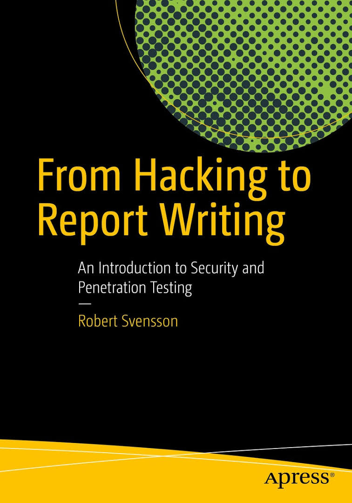

<!-- Section -->
<section>
	<header class="major">
		<h2>Libros Recomendados</h2>
	</header>
	

		<article>
			<h3>Pentesting con FOCA</h3>
			
			
Disponible en el siguiente <a href="http://0xword.com/es/libros/59-pentesting-con-foca.html">enlace</a>

		</article>
		<article>
			<h3>Google Hacking</h3>
			
			
Disponible en el siguiente
				<a href="https://www.amazon.com/Google-Hacking-Penetration-Testers-Third/dp/0128029641/ref=pd_lpo_sbs_14_t_0/145-3683179-5738901?_encoding=UTF8&psc=1&refRID=2CRMFRQXHNVP4ZQY7R31">
					enlace</a>.
</article>
		<article>
			<h3>No Tech Hacking A Guide to Social Engineering Dumpster Diving & Shoulder Surfing</h3>
			
			
Disponible en el siguiente <a href="https://www.amazon.com/No-Tech-Hacking-Engineering-Dumpster/dp/1597492159">enlace</a>.

		</article>
		<article>
			<h3>Pentesting con Kali</h3>
			
			
Disponible en el siguiente <a href="http://0xword.com/es/libros/40-libro-pentesting-kali.html">enlace</a>.

		</article>
		<article>
		<h3>Python Crash Course</h3>
		
		
Disponible en el siguiente <a href="https://www.nostarch.com/pythoncrashcourse">enlace</a>.

		</article>
		<article>
		<h3>Deep Web: TOR, FreeNET & I2P - Privacidad y Anonimato</h3>
		
		
Disponible en el siguiente <a href="http://0xword.com/es/libros/75-deep-web-tor-freenet-i2p-privacidad-y-anonimato.html#idTab5">enlace</a>.

		</article>
		<article>
		<h3>The hacker playbook 2: Practical guide to penetration testing.</h3>
		
		
Disponible en el siguiente <a href="https://www.amazon.com/Hacker-Playbook-Practical-Penetration-Testing/dp/1512214566">enlace</a>.

		</article>
		<article>
		<h3>Computer Security: Principles and Practice (3rd Edition).</h3>
		
		
Disponible en el siguiente <a href="https://www.amazon.com/Hacker-Playbook-Practical-Penetration-Testing/dp/1512214566">enlace</a>.

		</article>
		<article>
		<h3>Building a Comprehensive IT Security Program: Practical Guidelines and Best Practices</h3>
		
		
Disponible en el siguiente <a href="https://www.amazon.com/Building-Comprehensive-Security-Program-Guidelines/dp/1484220528">enlace</a>.

		</article>
		<article>
		<h3>From Hacking to Report Writing: An Introduction to Security and Penetration Testing</h3>
		
		
Disponible en el siguiente <a href="https://www.amazon.com/Hacking-Report-Writing-Introduction-Penetration/dp/1484222822">enlace</a>.

		</article>
		<article>
		<h3>The Web Application Hackers Handbook</h3>
		
		
Disponible en el siguiente <a href="https://www.amazon.com/Web-Application-Hackers-Handbook-Exploiting/dp/1118026470">enlace</a>.

		</article>
		<article>
		<h3>Malware en Android: Discovering, Reversing and Forensics</h3>
		
		
Disponible en el siguiente <a href="http://0xword.com/es/libros/76-malware-en-android-discovering-reversing-and-forensics.html">enlace</a>.

		</article>
		<article>
		<h3>Mobile Application Hackers Handbook</h3>
		
		
Disponible en el siguiente <a href="https://www.amazon.com/Mobile-Application-Hackers-Handbook/dp/1118958500">enlace</a>.

		</article>
		<article>
		<h3>Professional Assembly Language</h3>
		
		
Disponible en el siguiente <a href="https://www.amazon.com/Professional-Assembly-Language-Richard-Blum/dp/0764579010">enlace</a>.

		</article>
		<article>
		<h3>Penetration testing with shellcode</h3>
		
		
Disponible en el siguiente <a href="https://www.packtpub.com/networking-and-servers/penetration-testing-shellcode">enlace</a>.

		</article>
		<article>
		<h3>Ethical Hacking: Teoría y práctica para la realización de un Pentesting.</h3>
		
		
Disponible en el siguiente <a href="https://0xword.com/es/libros/65-ethical-hacking-teoria-y-practica-para-la-realizacion-de-un-pentesting.html">enlace</a>.

		</article>
		<article>
		<h3>Python for offensive pentest</h3>
		
		
Disponible en el siguiente <a href="https://www.packtpub.com/networking-and-servers/python-offensive-pentest">enlace</a>.

		</article>
		<article>
		<h3>Black Hat Python: Python Programming for Hackers and Pentesters</h3>
		
		
Disponible en el siguiente <a href="https://nostarch.com/blackhatpython">enlace</a>.

		</article>
		<article>
		<h3>Mastering Metasploit</h3>
		
		
Disponible en el siguiente <a href="https://www.packtpub.com/networking-and-servers/mastering-metasploit-second-edition">enlace</a>.

		</article>
		<article>
		<h3>Ataques en redes de datos ipv4 e ipv6</h3>
		
		
Disponible en el siguiente <a href="https://0xword.com/es/libros/26-libro-ataques-redes-datos-ipv4-ipv6.html">enlace</a>.

		</article>
		<article>
		<h3>Industrial Cybersecurity: Efficiently secure critical infrastructure systems</h3>
		
		
Disponible en el siguiente <a href="https://www.packtpub.com/networking-and-servers/industrial-cybersecurity">enlace</a>.

		</article>
		<article>
		<h3>Mastering Modern Web Penetration Testing</h3>
		
		
Disponible en el siguiente <a href="https://www.packtpub.com/networking-and-servers/mastering-modern-web-penetration-testing">enlace</a>.

		</article>
		<article>
		<h3>Burp Suite Cookbook:Practical recipes to help you master web penetration testing with Burp Suite</h3>
		
		
Disponible en el siguiente <a href="https://www.packtpub.com/networking-and-servers/burp-suite-cookbook">enlace</a>.

		</article>
		<article>
		<h3>Secure your node.js Web application, keep attackers out and users happy</h3>
		
		
Disponible en el siguiente <a href="https://www.amazon.com/Secure-Your-Node-js-Web-Application/dp/1680500856">enlace</a>.

		</article>
		<article>
		<h3>Hands-On Bug Hunting for Penetration Testers 1st Edition</h3>
		
		
Disponible en el siguiente <a href="https://www.packtpub.com/networking-and-servers/hands-bug-hunting-penetration-testers">enlace</a>.

		</article>
		<article>
		<h3>Web Hacking 101 How to Make Money Hacking Ethically 1st Edition</h3>
		
		
Disponible en el siguiente <a href="https://leanpub.com/web-hacking-101">enlace</a>.

		</article>		
		<article>
		<h3>Mastering Machine Learning for Penetration Testing</h3>
		
		
Disponible en el siguiente <a href="https://www.packtpub.com/networking-and-servers/mastering-machine-learning-penetration-testing">enlace</a>.

		</article>
		<article>
		<h3>Hands-on cybersecurity for finance</h3>
		
		
Disponible en el siguiente <a href="https://www.packtpub.com/networking-and-servers/hands-cybersecurity-finance">enlace</a>.

		</article>
	

</section>
