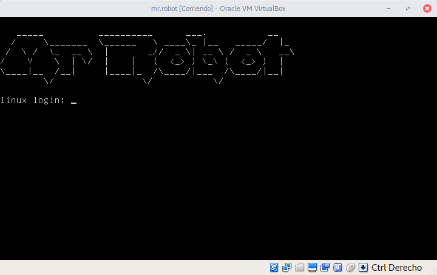

<!-- Section -->
<section>
	<header class="major">
		<h2>Capture The Flag Walkthroughs</h2>
	</header>
	

		<article>
			
			<h3>Mr.Robot</h3>
			
Maquina virtual vulnerable 

		</article>
	

</section>
