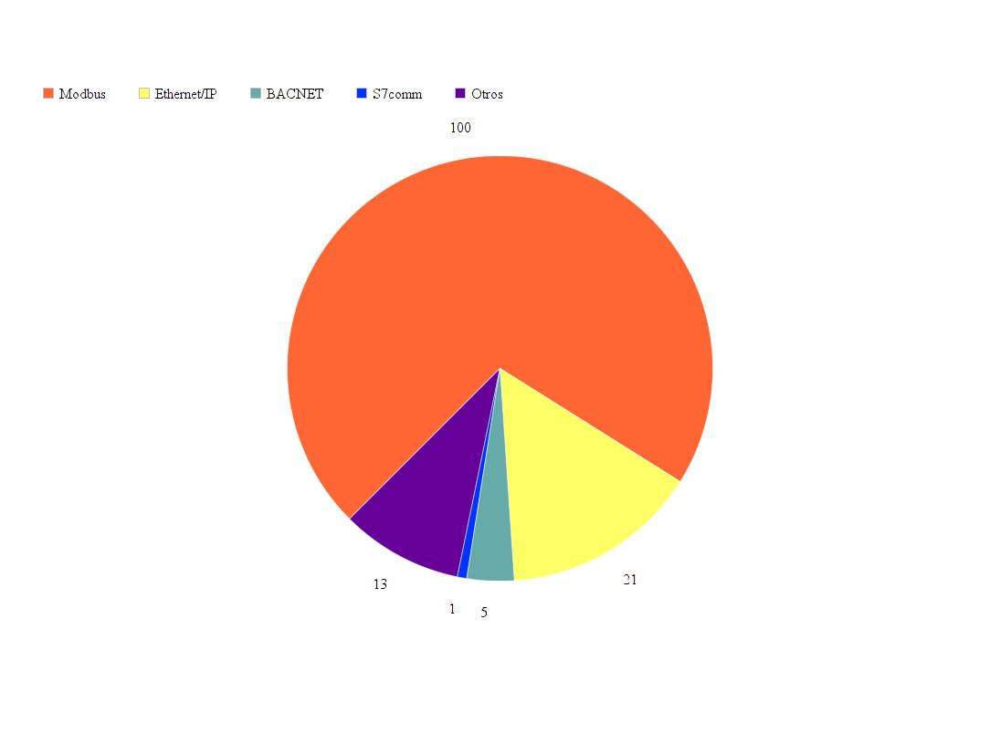

 
## Estado actual dispositivos ICS en Chile:

Hola a aquellos que siguen el blog, en esta ocasión voy a hablar de un tema no menor
, creo no se ha tomado en cuenta la importancia que se debe en el país al uso de sistemas de control industrial. Si bien hay modelos (arquitecturas) bien definidos	para reducir los riesgos de fallo, hay organizaciones que siguen usando ICS como si se tratara de cualquier dispositivo conectado a la infraestructura de IT, no creen que mantener sus OT sea un asunto de importancia. Por lo que usan 
la misma red para la lógica de negocio y la operacional, además de la aberración de poner este tipo
de dispositivos a la vista de cualquiera en internet.

Es por esto que decidí realizar una búsqueda de sistemas ICS en Chile que estuvieran "públicos"
en internet, sí, hay personas que conectan un módem 3G o 4G, etc directamente a un PLC, un dispositivo SCADA, sin apenas asociar esto a un gran peligro, y no me refiero sólo a perjuicios
económicos, según el uso que se haga del sistema, la integridad física de personas está en juego.

Considerando el estado paranoico de algunos sysadmins luego de la filtración de datos de tarjetas 
de crédito de entidades bancarias del páis por la red (no daré mi opinión al respecto), en lugar de 
hacer yo mismo el escaneo, aprovecharé los resultados de servicios como <a href="https://shodan.io">shodan.io</a>, para obtener algunas estadísticas de dispositivos de control industrial que estén
conectados directamente a internet.

Pero antes para aquellos que no tengan claro el por qué es tan problemático disponer de estos sistemas en internet les daré la siguiente aclaración, primero algunos de los protocolos más usados
por sistemas de control industrial para comunicarse entre sí (por ejemplo PLC a PLC), o a otras capas de la organización (por ejemplo a una Engineering WorkStation), se originaron en periodos
en los cuales en enlace entre los dispositivos era realizado por medio de cables seriales como el 
RS-232 para la programación, etc. Ahora bien, con el paso del tiempo, se adaptó estos protocolos
a las nuevas necesidades como la interacción con otras zonas de las organizaciones.

Esto acarreó los siguientes problemas:
1. No se usa verificación de <strong>integridad</strong>.
2. No se <strong>cifran</strong> los datos.
3. algunos protocolos aprovechan el modelo OSI, TCP/IP,	exponiéndo los dispositivos a los mismo ataques ya archiconocidos a estos protocolos.
4. No poseen medios de <strong>autenticación</strong>.

Por ejemplo se tiene el caso del protocolo <strong>Modbus</strong>, el que paso a 
<strong>Modbus TCP/IP</strong>, el cual usa el puerto 502, gracias a este protocolo
se puede leer y escribir (I/O) datos a un PLC por ejemplo, lo que de hacerse en un nivel
propio de organización no trae inconvenientes (con las precauciones pertinentes), pero si esto
es manipulado con mala intención podría afectar de las siguientes maneras el correcto funcionamiento:

1. Manipular los valores mostrados por ejemplo en un <a href="https://en.wikipedia.org/wiki/Human%E2%80%93machine_interface">HMI</a>.
2. Manipular la acción de control automático.
3. Generar errores en la toma de decisiones.

Y un largo etc. se imagina las repercuciones  que tendría el cambiar los valores mostrados al personal sobre la temperatura de un sistema, y hacer parecer que todo va normal cuando en realidad, se está fundiendo una máquina la que provocará un incendio. Le tengo una mala noticia,
esto es posible, ya que los datos se pueden manipular ya que no se debe autenticar, si, no hay que 
colocar una contraseña, o usar algún método más sofisticado. Es por esto que los dispositivos que utilicen Modbus <strong>NUNCA</strong> deben estar expuestos a internet, o pertenecer a la misma red
que todos los sistemas de IT, para estos fines se puede usar el modelo arquitectural <a href="https://en.wikipedia.org/wiki/Purdue_Enterprise_Reference_Architecture">PERA</a>, el cual crea tres zonas (Enterprise zone, IDMZ, Manufacturing zone), y seis niveles.

Otro de los protocolos usados habitualmente en entornos industriales es el S7comm, profinet, Ethernet/IP(Industrial Protocol), etc. Algunos de estos han incorporado el uso de contraseñas, pero las medidas orientadas a la seguridad deben ser actualizadas a los tiempos actuales, debo señalar que hay protocolos usados para automatización de edificios, como BACNET, por lo que incluiré en el estudio los siguientes protocolos:

 * Modbus
 * s7comm
 * BACNET
 * Ethernet/IP

 Por lo que si se realiza una búsqueda de estos protocolos expuestos a internet en Chile se obtendrán los siguientes resultados desde servicios como Shodan.io, Censys.io, zoomeye.org, etc.

El total de dispositivos expuestos es igual a 140 al momento de escribir este texto, de estos 
100 corresponden a Modbus, 1 a s7comm, 6 a dnp3, 7 a fox, y 21 Ethernet/IP, BACNET 5.

Como podemos observar en la figura, la existencia de estos dispositivos en internet ya es malo, pero que 
además la mayor parte sea justamente aquellos que utilizan el protocolo Modbus, lo hace aún peor. Si bien el número de dispositivos en comparación a otros países podría considerarse bajo, hay que tener en cuenta el número de industrias en el país. Los dispositivos cuyo protocolo es Ethernet/IP, también es no menor, si hacemos la suposición que pueden ser detenidos, y que no todos corresponden a la misma empresa,
que efectos tendrá el suspender su funcionamiento.

Imagine que algunos de estos dispositivos se encargan de funciones relacionadas a la distribución de energía electrica, no se puede dejar de prestar la debida atención.

Pido al lector en caso de poseer dispositivos de control industrial, realice un análisis a conciencia de sus dispositivos y revise si éstos pueden ser accedidos desde internet, espero lo haga antes de ser objeto de ciber ataques, ya que debe preocuparse con especial atención de scriptkiddies, ya que no les importará las consecuencias de presionar algunas teclas de sus computadores.

Espero que esta entrada sea de utilidad y que ayude a generar un cambio en el switch.

NOTA: En próximas entradas publicaré medios de ataque (básicos por motivos obvios) a dispositivos ICS usando algunos de estos protocolos mencionados anteriormente, con los medios defensivos, correctivos respectivos.

Gracias y hasta la próxima.