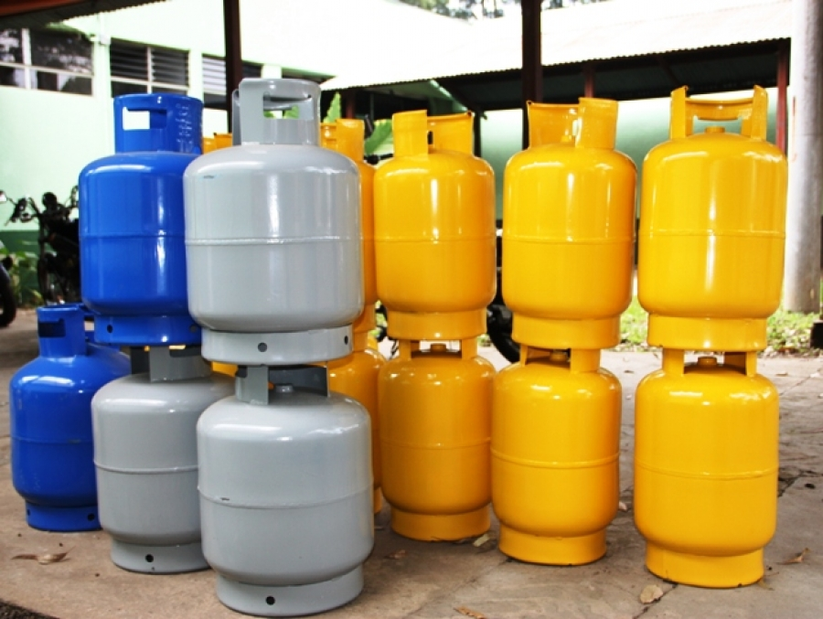
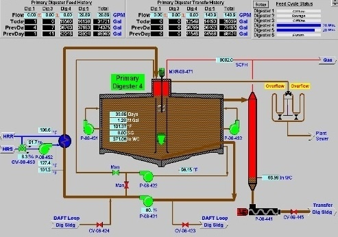

<!-- Section -->

<section>

<article>
  
 CTF Walkthroughs 

  
  <h3>Mr.Robot</h3>
  
Maquina virtual vulnerable 

</article>
<article>
  
 Captura de malware 

  
  <h3>Como crear una red de Honeypots</h3>
  
para captura de malware 

</article>
<article>
   
 Android 

  
  <h3>Análisis aplicaciones compra de gas licuado en Chile</h3>
  
¿Cómo afectan la privacidad y seguridad de sus usuarios? (primera parte)

</article>
<article>
      
      <h3>Estado sistemas de control industrial en Chile</h3>
      
¿Hay conciencia de los riegos asociados por una mala configuración?

</article>

</section>
