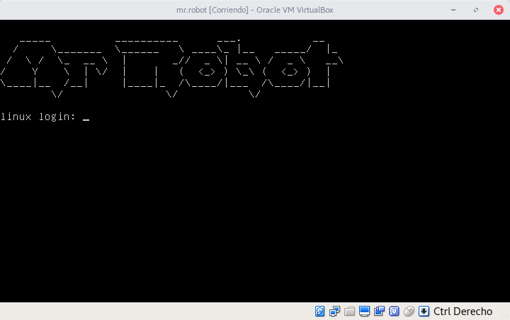

<!-- Section -->

<section>

  

  <article>
  
 CTF Walkthroughs 

  
  <h3>Mr.Robot</h3>
  
Maquina virtual vulnerable 

</article>
<article>
  
 Captura de malware 

  
  <h3>Como crear una red de Honeypots</h3>
  
para captura de malware 

</article>

</section>
